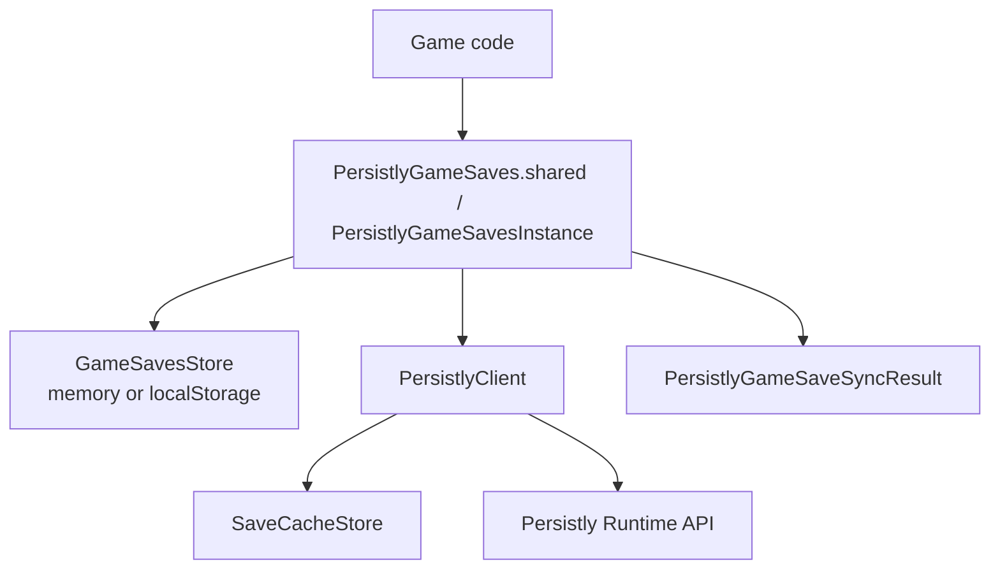
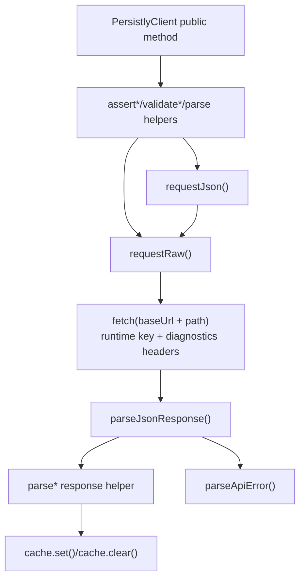
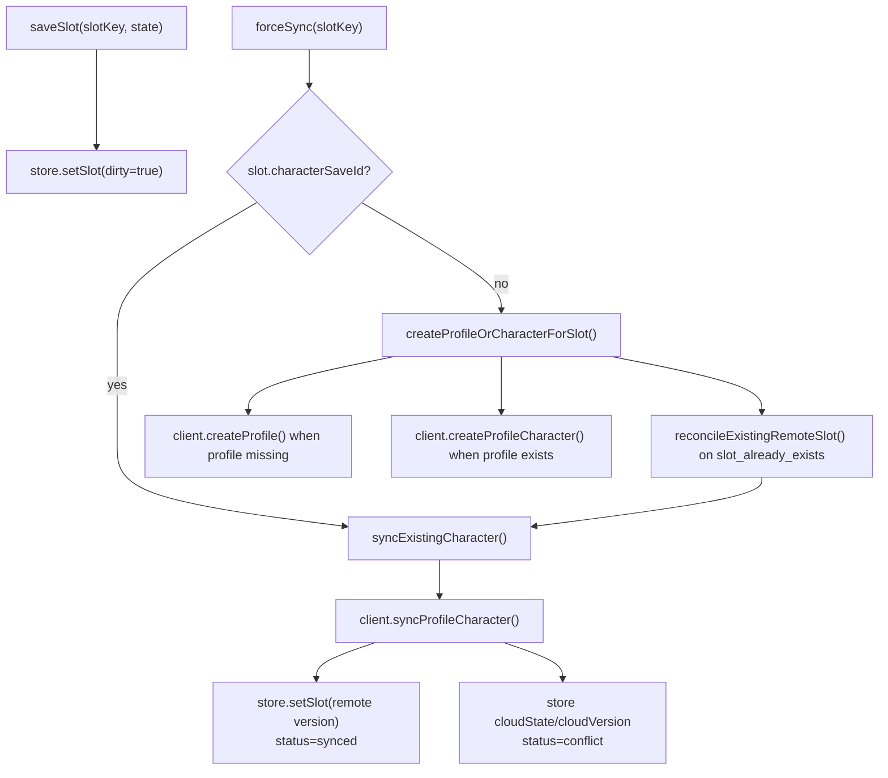
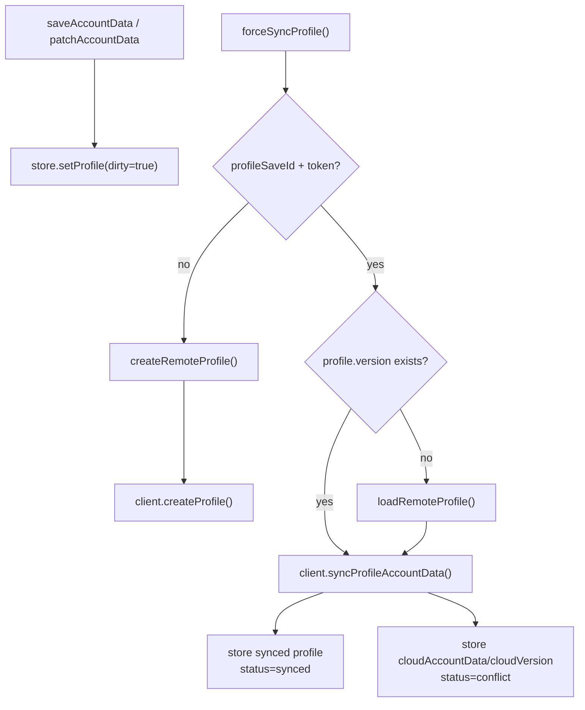

# Persistly JavaScript SDK Public Methods

Generated from the current source under `src/`.

Package: `@persistlyapp/sdk`

Important note: the source currently has no JSDoc/comment blocks immediately above public methods or exported functions. The "Comments" entries below therefore say `None`.

## 1. Public API Surface

### Root Export

`src/index.ts` re-exports:

- `autosave.ts`
- `cache.ts`
- `client.ts`
- `errors.ts`
- `file-cache.ts`
- `game-saves.ts`
- `local-storage-cache.ts`
- `profile.ts`

### `PersistlyClient`

Low-level runtime API client.

Public constructor and methods:

- `constructor(options: PersistlyClientOptions)`
- `updateLocal(save: Save): Promise<Save>`
- `getLocal(saveId: string): Promise<Save | null>`
- `createSave(payload: CreateSaveInput): Promise<Save>`
- `createProfile(payload: CreateProfileInput): Promise<CreatedProfileEnvelope>`
- `syncProfileAccountData(payload: SyncProfileAccountDataInput): Promise<SyncSaveResult>`
- `loadProfile(payload: ProfileSessionInput): Promise<Save>`
- `loadProfileEnvelope(payload: ProfileSessionInput): Promise<ProfileEnvelope>`
- `deleteProfile(payload: ProfileSessionInput): Promise<DeleteProfileResult>`
- `createProfileCharacter(payload: CreateProfileCharacterInput): Promise<ProfileCharacterEnvelope>`
- `loadProfileCharacter(payload: ProfileCharacterInput): Promise<Save>`
- `deleteProfileCharacter(payload: ProfileCharacterInput): Promise<DeleteProfileCharacterResult>`
- `syncProfileCharacter(payload: SyncProfileCharacterInput): Promise<SyncSaveResult>`
- `archiveProfileCharacter(payload: ProfileCharacterInput): Promise<ProfileEnvelope>`
- `getRuntimeConfig(options?: RuntimeConfigOptions): Promise<RuntimeConfig>`
- `loadSave(saveId: string): Promise<Save>`
- `syncSave(saveId: string, payload: SyncSaveInput): Promise<SyncSaveResult>`

### `PersistlyGameSaves`

High-level browser/game facade.

Public static members:

- `shared: PersistlyGameSavesFacade`
- `start(config: PersistlyGameSavesConfig): Promise<PersistlyGameSavesInstance>`
- `configure(config: PersistlyGameSavesConfig): Promise<void>`

### `PersistlyGameSavesInstance`

High-level local-first game-saves facade.

Public methods:

- `createProfile(): Promise<PersistlyEnsureProfileResult>`
- `attachProfile(options: PersistlyAttachProfileOptions): Promise<PersistlyEnsureProfileResult>`
- `ensureProfile(): Promise<PersistlyEnsureProfileResult>`
- `getProfileSession(options?: { includeToken?: boolean }): Promise<PersistlyProfileSession>`
- `inspectProfile(): Promise<PersistlyProfileInspection>`
- `getAccountData(): Promise<JsonObject>`
- `saveAccountData(accountData: JsonObject): Promise<PersistlyGameSaveSyncResult>`
- `patchAccountData(accountDataPatch: JsonObject): Promise<PersistlyGameSaveSyncResult>`
- `forceSyncProfile(options?: PersistlyGameSavesSyncOptions): Promise<PersistlyGameSaveSyncResult>`
- `syncDueProfile(options?: PersistlyGameSavesSyncOptions): Promise<PersistlyGameSaveSyncResult>`
- `loadSlot(slotKey: string): Promise<PersistlySlotInspection>`
- `saveSlot(slotKey: string, state: JsonObject, options?: PersistlyGameSavesSaveSlotOptions): Promise<PersistlyGameSaveSyncResult>`
- `listSlots(options?: { includeArchived?: boolean }): Promise<PersistlySlotInspection[]>`
- `inspectSlot(slotKey: string): Promise<PersistlySlotInspection>`
- `refreshSlot(slotKey: string): Promise<PersistlyGameSaveSyncResult>`
- `forceSync(slotKey: string, options?: PersistlyGameSavesSyncOptions): Promise<PersistlyGameSaveSyncResult>`
- `syncDueSlots(options?: PersistlyGameSavesSyncOptions): Promise<PersistlyGameSaveSyncResult[]>`
- `syncDue(options?: PersistlyGameSavesSyncOptions): Promise<PersistlyGameSaveSyncResult[]>`
- `archiveSlot(slotKey: string): Promise<PersistlyGameSaveSyncResult>`
- `deleteProfile(): Promise<PersistlyGameSaveSyncResult>`
- `deleteSlot(slotKey: string): Promise<PersistlyGameSaveSyncResult>`
- `clearLocalProfile(): Promise<PersistlyGameSaveSyncResult>`
- `clearLocalSlot(slotKey: string): Promise<PersistlyGameSaveSyncResult>`
- `acceptCloudVersion(slotKey: string): Promise<PersistlyGameSaveSyncResult>`
- `overwriteCloudVersion(slotKey: string, options?: PersistlyGameSavesSyncOptions): Promise<PersistlyGameSaveSyncResult>`
- `keepLocalForLater(slotKey: string): Promise<PersistlyGameSaveSyncResult>`

### Autosave Helpers

Public classes and methods:

- `MemoryAutosaveDraftStore.get(profileSaveId, characterSaveId)`
- `MemoryAutosaveDraftStore.set(profileSaveId, characterSaveId, draft)`
- `MemoryAutosaveDraftStore.clear(profileSaveId, characterSaveId)`
- `LocalStorageAutosaveDraftStore.constructor(options?)`
- `LocalStorageAutosaveDraftStore.get(profileSaveId, characterSaveId)`
- `LocalStorageAutosaveDraftStore.set(profileSaveId, characterSaveId, draft)`
- `LocalStorageAutosaveDraftStore.clear(profileSaveId, characterSaveId)`
- `PersistlyAutosaveManager.constructor(options)`
- `PersistlyAutosaveManager.recordLocalChange(draft)`
- `PersistlyAutosaveManager.tick()`
- `PersistlyAutosaveManager.forceSync()`

### Cache Helpers

Public classes and methods:

- `MemorySaveCache.get(saveId)`
- `MemorySaveCache.set(snapshot)`
- `MemorySaveCache.clear(saveId)`
- `FileSaveCache.constructor(directory)`
- `FileSaveCache.get(saveId)`
- `FileSaveCache.set(snapshot)`
- `FileSaveCache.clear(saveId)`
- `LocalStorageSaveCache.constructor(options?)`
- `LocalStorageSaveCache.get(saveId)`
- `LocalStorageSaveCache.set(snapshot)`
- `LocalStorageSaveCache.clear(saveId)`

### Profile Helpers

Public functions:

- `buildProfileState(input?): PersistlyProfileState`
- `addCharacterToProfileState(profileState, characterSave, slotKey): PersistlyProfileState`
- `isPersistlyProfileState(value): value is PersistlyProfileState`

### Schema Helpers

Public functions:

- `parseObject(value, label): JsonObject`
- `parseSaveSnapshot(value): SaveSnapshot`
- `cloneSaveSnapshot(snapshot): SaveSnapshot`

### Error Helpers

Public function:

- `createPersistlyApiError(status, code, message, details?): PersistlyApiError`

Public error classes:

- `PersistlyApiError`
- `PersistlyInvalidRequestError`
- `PersistlyUnauthorizedError`
- `PersistlyForbiddenError`
- `PersistlyNotFoundError`
- `PersistlyConflictError`
- `PersistlySlotAlreadyExistsError`
- `PersistlyCharacterArchivedError`
- `PersistlyProfileDeletedError`
- `PersistlyCharacterDeletedError`
- `PersistlyRateLimitedError`
- `PersistlyPayloadTooLargeError`
- `PersistlyServerError`
- `PersistlyTransportError`
- `PersistlyConfigurationError`
- `PersistlyStorageError`

## 2. Public Method Call Details

### Mermaid: High-Level Facade Flow

### Mermaid: Runtime Client Request Flow

### `PersistlyClient`

#### `constructor(options)`

Comments: None.

Private/helpers called:

- `bindFetch(globalThis.fetch)`
- `buildDiagnosticsHeaders(options)`
- `new MemorySaveCache()` when `options.cache` is not provided

#### `updateLocal(save)`

Comments: None.

Private/helpers called:

- `parseSave(save)`
- `cache.set(canonicalSave)`

#### `getLocal(saveId)`

Comments: None.

Private/helpers called:

- `assertSaveId(saveId, "getLocal")`
- `cache.get(saveId)`

#### `createSave(payload)`

Comments: None.

Private/helpers called:

- `validatePayloadLimits(payload)`
- `requestJson("/api/v1/saves", { method: "POST", body })`
- `parseSaveEnvelope(response)`
- `cache.set(save)`

#### `createProfile(payload)`

Comments: None.

Private/helpers called:

- `validateProfileCreatePayload(payload)`
- `requestJson("/api/v1/profiles", { method: "POST", body })`
- `parseProfileEnvelope(response)`
- `requireCreatedProfileEnvelope(envelope)`
- `cache.set(envelope.profile)`
- `cache.set(envelope.character)` when present

#### `syncProfileAccountData(payload)`

Comments: None.

Private/helpers called:

- `assertSaveId(payload.profileSaveId, "syncProfileAccountData")`
- `assertProfileSessionToken(payload.profileSessionToken, "syncProfileAccountData")`
- `validateSyncProfileAccountDataPayload(payload)`
- `validatePayloadLimits(...)`
- `requestRaw("/api/v1/profiles/{profileSaveId}/account-data/sync", ...)`
- `profileSessionHeaders(payload.profileSessionToken)`
- `parseJsonResponse(response)`
- On HTTP `200`:
  - `parseAcceptedSyncResult(json)`
  - `cache.get(profileSaveId)`
  - `synthesizeProfileSaveFromSync(...)` when accepted response does not include a save
  - `syncAcceptedResultWithSave(accepted, save)`
  - `cache.set(result.save)`
- On HTTP `409` conflict:
  - `isSyncConflictPayload(json)`
  - `parseConflictSyncResult(json)`
  - `cache.set(result.save)`
- Otherwise:
  - `parseApiError(response.status, json)`

#### `loadProfile(payload)`

Comments: None.

Private/helpers called:

- `loadProfileEnvelope(payload)`

#### `loadProfileEnvelope(payload)`

Comments: None.

Private/helpers called:

- `assertSaveId(payload.profileSaveId, "loadProfile")`
- `assertProfileSessionToken(payload.profileSessionToken, "loadProfile")`
- `requestJson("/api/v1/profiles/{profileSaveId}", { method: "GET" })`
- `profileSessionHeaders(payload.profileSessionToken)`
- `parseProfileEnvelope(response)`
- `cache.set(envelope.profile)`
- `cache.set(envelope.character)` when present

#### `deleteProfile(payload)`

Comments: None.

Private/helpers called:

- `assertSaveId(payload.profileSaveId, "deleteProfile")`
- `assertProfileSessionToken(payload.profileSessionToken, "deleteProfile")`
- `requestJson("/api/v1/profiles/{profileSaveId}", { method: "DELETE" })`
- `profileSessionHeaders(payload.profileSessionToken)`
- `parseDeleteProfileResult(response)`
- `cache.clear(payload.profileSaveId)`

#### `createProfileCharacter(payload)`

Comments: None.

Private/helpers called:

- `assertSaveId(payload.profileSaveId, "createProfileCharacter")`
- `assertProfileSessionToken(payload.profileSessionToken, "createProfileCharacter")`
- `requireProfileCharacterSlotMetadata(payload.metadata, "createProfileCharacter.metadata")`
- `validatePayloadLimits({ metadata, state })`
- `requestJson("/api/v1/profiles/{profileSaveId}/characters", { method: "POST" })`
- `profileSessionHeaders(payload.profileSessionToken)`
- `parseProfileEnvelope(response)`
- `requireProfileCharacterEnvelope(envelope)`
- `cache.set(envelope.profile)`
- `cache.set(envelope.character)` when present

#### `loadProfileCharacter(payload)`

Comments: None.

Private/helpers called:

- `assertSaveId(payload.profileSaveId, "loadProfileCharacter")`
- `assertSaveId(payload.characterSaveId, "loadProfileCharacter")`
- `assertProfileSessionToken(payload.profileSessionToken, "loadProfileCharacter")`
- `requestJson("/api/v1/profiles/{profileSaveId}/characters/{characterSaveId}", { method: "GET" })`
- `profileSessionHeaders(payload.profileSessionToken)`
- `parseSaveEnvelope(response)`
- `cache.set(save)`

#### `deleteProfileCharacter(payload)`

Comments: None.

Private/helpers called:

- `assertSaveId(payload.profileSaveId, "deleteProfileCharacter")`
- `assertSaveId(payload.characterSaveId, "deleteProfileCharacter")`
- `assertProfileSessionToken(payload.profileSessionToken, "deleteProfileCharacter")`
- `requestJson("/api/v1/profiles/{profileSaveId}/characters/{characterSaveId}", { method: "DELETE" })`
- `profileSessionHeaders(payload.profileSessionToken)`
- `parseDeleteProfileCharacterResult(response)`
- `cache.clear(payload.characterSaveId)`
- `cache.set(result.profile)` when returned

#### `syncProfileCharacter(payload)`

Comments: None.

Private/helpers called:

- `assertSaveId(payload.profileSaveId, "syncProfileCharacter")`
- `assertSaveId(payload.characterSaveId, "syncProfileCharacter")`
- `assertProfileSessionToken(payload.profileSessionToken, "syncProfileCharacter")`
- `validateReservedProfileCharacterMetadata(...)` when metadata is present
- `validatePayloadLimits(payload)`
- `cache.get(payload.characterSaveId)`
- `requestRaw("/api/v1/profiles/{profileSaveId}/characters/{characterSaveId}/sync", ...)`
- `profileSessionHeaders(payload.profileSessionToken)`
- `parseJsonResponse(response)`
- On HTTP `200`:
  - `parseAcceptedSyncResult(json)`
  - `synthesizeSaveFromSync(...)` when accepted response does not include a save
  - `syncAcceptedResultWithSave(accepted, save)`
  - `cache.set(result.save)`
- On HTTP `409` conflict:
  - `isSyncConflictPayload(json)`
  - `parseConflictSyncResult(json)`
  - `cache.set(result.save)`
- Otherwise:
  - `parseApiError(response.status, json)`

#### `archiveProfileCharacter(payload)`

Comments: None.

Private/helpers called:

- `assertSaveId(payload.profileSaveId, "archiveProfileCharacter")`
- `assertSaveId(payload.characterSaveId, "archiveProfileCharacter")`
- `assertProfileSessionToken(payload.profileSessionToken, "archiveProfileCharacter")`
- `requestJson("/api/v1/profiles/{profileSaveId}/characters/{characterSaveId}/archive", { method: "POST" })`
- `profileSessionHeaders(payload.profileSessionToken)`
- `parseProfileEnvelope(response)`
- `cache.set(envelope.profile)`
- `cache.set(envelope.character)` when present

#### `getRuntimeConfig(options)`

Comments: None.

Private/helpers called:

- `runtimeConfigPath(options)`
- `requestJson(path, { method: "GET" })`
- `parseRuntimeConfig(response)`

#### `loadSave(saveId)`

Comments: None.

Private/helpers called:

- `assertSaveId(saveId, "loadSave")`
- `requestJson("/api/v1/saves/{saveId}", { method: "GET" })`
- `parseSaveEnvelope(response)`
- `cache.set(save)`

#### `syncSave(saveId, payload)`

Comments: None.

Private/helpers called:

- `assertSaveId(saveId, "syncSave")`
- `validatePayloadLimits(payload)`
- `cache.get(saveId)`
- `requestRaw("/api/v1/saves/{saveId}/sync", ...)`
- `parseJsonResponse(response)`
- On HTTP `200`:
  - `parseAcceptedSyncResult(json)`
  - `synthesizeSaveFromSync(...)` when accepted response does not include a save
  - `syncAcceptedResultWithSave(accepted, save)`
  - `cache.set(result.save)`
- On HTTP `409`:
  - `parseConflictSyncResult(json)`
  - `cache.set(result.save)`
- Otherwise:
  - `parseApiError(response.status, json)`

### `PersistlyGameSaves`

#### `start(config)`

Comments: None.

Private/helpers called:

- `new PersistlyGameSavesInstance(config)`

#### `configure(config)`

Comments: None.

Private/helpers called:

- `PersistlyGameSaves.start(config)`
- Assigns `PersistlyGameSaves.shared`

### `PersistlyGameSavesInstance`

#### `constructor(config)`

Comments: None.

Private/helpers called:

- `new PersistlyClient({ runtimeKey, fetch? })`
- `createStore(config)`
- initializes `now()`

#### `createProfile()`

Comments: None.

Private/helpers called:

- `assertNoExistingLocalProfileState(...)`
- `getOrCreateLocalProfile()`
- `createRemoteProfile(profile)`
- `profileRecordToSave(created)`

#### `attachProfile(options)`

Comments: None.

Private/helpers called:

- `assertNoExistingLocalProfileState(...)`
- `store.setProfile(seed)`
- `loadRemoteProfile(seed)`
- `profileRecordToSave(attached)`

#### `ensureProfile()`

Comments: None.

Private/helpers called:

- `getOrCreateLocalProfile()`
- `createRemoteProfile(existing)` when no fully synced profile exists
- `profileRecordToSave(profile)`

#### `getProfileSession(options)`

Comments: None.

Private/helpers called:

- `store.getProfile()`

#### `saveAccountData(accountData)`

Comments: None.

Private/helpers called:

- `getOrCreateLocalProfile()`
- `parseObject(accountData, "accountData")`
- `clone(...)`
- `store.setProfile(...)`

#### `patchAccountData(accountDataPatch)`

Comments: None.

Private/helpers called:

- `parseObject(accountDataPatch, "accountDataPatch")`
- `getOrCreateLocalProfile()`
- `clone(profile.accountData)`
- `store.setProfile(...)`

#### `forceSyncProfile(options)`

Comments: None.

Private/helpers called:

- `getOrCreateLocalProfile()`
- `hasProfileSession(profile)`
- `loadRemoteProfile(profile)` when session exists but version is missing
- `isForceSyncAllowed(profile.lastRemoteSyncedAt, profile.syncPolicy)`
- `createRemoteProfile(profile)` when profile is not remote-created yet
- `client.syncProfileAccountData(...)`
- On conflict:
  - `readProfileAccountData(result.save)`
  - `clone(...)`
  - `store.setProfile(conflictedProfile)`
  - `emit(conflictResult)`
- On accepted sync:
  - `profileFromSave(result.save, token, syncPolicy)`
  - `store.setProfile(...)`
  - `emit(syncedResult)`
- On handled errors:
  - `mapSyncError(error, Profile)`

#### `syncDueProfile(options)`

Comments: None.

Private/helpers called:

- `store.getProfile()`
- `isDue(profile.lastRemoteSyncedAt, profile.syncPolicy)`
- `forceSyncProfile({ ...options, bypassCooldown: true })`

#### `inspectProfile()`

Comments: None.

Private/helpers called:

- `store.getProfile()`
- `clone(...)` for metadata, account data, character slots, and cloud conflict fields

#### `getAccountData()`

Comments: None.

Private/helpers called:

- `store.getProfile()`
- `clone(...)`

#### `loadSlot(slotKey)`

Comments: None.

Private/helpers called:

- `inspectSlot(slotKey)`

#### `saveSlot(slotKey, state, options)`

Comments: None.

Private/helpers called:

- `getOrCreateLocalProfile()`
- `assertSlotKey(slotKey)`
- `store.getSlot(canonicalSlotKey)`
- `developerSlotMetadata(...)`
- `parseObject(state, "slot.state")`
- `clone(...)`
- `store.setSlot(record)`

#### `listSlots(options)`

Comments: None.

Private/helpers called:

- `store.listSlotKeys()`
- `inspectSlot(slotKey)` for each slot

#### `inspectSlot(slotKey)`

Comments: None.

Private/helpers called:

- `assertSlotKey(slotKey)`
- `store.getSlot(canonicalSlotKey)`
- `clone(...)` for state, metadata, and conflict/cloud fields

#### `refreshSlot(slotKey)`

Comments: None.

Private/helpers called:

- `assertSlotKey(slotKey)`
- `requireProfileSession("refreshSlot")`
- `store.getSlot(canonicalSlotKey)`
- `materializeProfileSlotRefs(profile)` when slot refs need local stubs
- `client.loadProfileCharacter(...)`
- `store.setSlot(...)`
- `slotFromSave(...)`
- `stripReservedSlotMetadata(...)`
- `emit(result)`
- `mapSyncError(error, Slot, slotKey)`

#### `forceSync(slotKey, options)`

Comments: None.

Private/helpers called:

- `assertSlotKey(slotKey)`
- `store.getSlot(canonicalSlotKey)`
- `store.getProfile()`
- `isForceSyncAllowed(slot.lastRemoteSyncedAt, profile.syncPolicy)`
- `syncExistingCharacter(slot)` when `slot.characterSaveId` exists
- `createProfileOrCharacterForSlot(slot)` when slot is local-only
- `emit(result)`
- `mapSyncError(error, Slot, slotKey)`

#### `syncDueSlots(options)`

Comments: None.

Private/helpers called:

- `store.listSlotKeys()`
- `store.getSlot(slotKey)`
- `store.getProfile()`
- `isDue(slot.lastRemoteSyncedAt, profile.syncPolicy)`
- `forceSync(slotKey, { ...options, bypassCooldown: true })`

#### `syncDue(options)`

Comments: None.

Private/helpers called:

- `store.getProfile()`
- `syncDueProfile(options)`
- `syncDueSlots(options)`

#### `archiveSlot(slotKey)`

Comments: None.

Private/helpers called:

- `assertSlotKey(slotKey)`
- `requireProfileSession("archiveSlot")`
- `store.getSlot(canonicalSlotKey)`
- `client.archiveProfileCharacter(...)`
- `profileFromSave(envelope.profile, token, syncPolicy)`
- `store.setProfile(...)`
- `store.setSlot(...)`
- `emit(result)`
- `mapSyncError(error, Slot, slotKey)`

#### `deleteProfile()`

Comments: None.

Private/helpers called:

- `store.getProfile()`
- `store.listSlotKeys()`
- Local-only path:
  - `store.deleteSlot(slotKey)` for each slot
  - `store.deleteProfile()`
  - `emit(localResult)`
- Remote path:
  - `requireProfileSession("deleteProfile")`
  - `client.deleteProfile(...)`
  - `store.deleteSlot(slotKey)` for each slot
  - `store.deleteProfile()`
  - `emit(syncedResult)`

#### `deleteSlot(slotKey)`

Comments: None.

Private/helpers called:

- `assertSlotKey(slotKey)`
- `store.getSlot(canonicalSlotKey)`
- Local-only path:
  - `store.deleteSlot(canonicalSlotKey)`
  - `store.getProfile()`
  - `removeSlotRefFromProfile(profile, canonicalSlotKey)`
  - `store.setProfile(...)`
  - `emit(localResult)`
- Remote path:
  - `requireProfileSession("deleteSlot")`
  - `client.deleteProfileCharacter(...)`
  - `store.deleteSlot(canonicalSlotKey)`
  - `profileFromSave(result.profile, token, syncPolicy)` when profile is returned
  - `removeSlotRefFromProfile(...)` when profile is not returned
  - `store.setProfile(...)`
  - `emit(syncedResult)`

#### `clearLocalProfile()`

Comments: None.

Private/helpers called:

- `store.listSlotKeys()`
- `store.deleteSlot(slotKey)` for each slot
- `store.deleteProfile()`

#### `clearLocalSlot(slotKey)`

Comments: None.

Private/helpers called:

- `assertSlotKey(slotKey)`
- `store.deleteSlot(canonicalSlotKey)`

#### `acceptCloudVersion(slotKey)`

Comments: None.

Private/helpers called:

- `assertSlotKey(slotKey)`
- `store.getSlot(canonicalSlotKey)`
- `stripReservedSlotMetadata(...)`
- `clone(...)`
- `store.setSlot(...)`

#### `overwriteCloudVersion(slotKey, options)`

Comments: None.

Private/helpers called:

- `assertSlotKey(slotKey)`
- `store.getSlot(canonicalSlotKey)`
- `store.setSlot({ ...slot, version: slot.cloudVersion })` when cloud version exists
- `forceSync(canonicalSlotKey, options)`

#### `keepLocalForLater(slotKey)`

Comments: None.

Private/helpers called:

- `assertSlotKey(slotKey)`
- `store.getSlot(canonicalSlotKey)`
- `store.setSlot({ ...slot, dirty: true })`

### Mermaid: Slot Sync Flow

### Mermaid: Profile Sync Flow

### Autosave Helpers

#### `MemoryAutosaveDraftStore.get(profileSaveId, characterSaveId)`

Comments: None.

Private/helpers called:

- `draftKey(profileSaveId, characterSaveId)`
- `structuredClone(draft)`

#### `MemoryAutosaveDraftStore.set(profileSaveId, characterSaveId, draft)`

Comments: None.

Private/helpers called:

- `draftKey(profileSaveId, characterSaveId)`
- `structuredClone(draft)`

#### `MemoryAutosaveDraftStore.clear(profileSaveId, characterSaveId)`

Comments: None.

Private/helpers called:

- `draftKey(profileSaveId, characterSaveId)`

#### `LocalStorageAutosaveDraftStore.constructor(options)`

Comments: None.

Private/helpers called:

- Reads `globalThis.localStorage` when `options.storage` is not provided.

#### `LocalStorageAutosaveDraftStore.get(profileSaveId, characterSaveId)`

Comments: None.

Private/helpers called:

- `resolveKey(profileSaveId, characterSaveId)`
- `storage.getItem(key)`
- `JSON.parse(value)`
- `normalizeDraft(draft)`

#### `LocalStorageAutosaveDraftStore.set(profileSaveId, characterSaveId, draft)`

Comments: None.

Private/helpers called:

- `resolveKey(profileSaveId, characterSaveId)`
- `normalizeDraft(draft)`
- `JSON.stringify(...)`
- `storage.setItem(key, value)`

#### `LocalStorageAutosaveDraftStore.clear(profileSaveId, characterSaveId)`

Comments: None.

Private/helpers called:

- `resolveKey(profileSaveId, characterSaveId)`
- `storage.removeItem(key)`

#### `PersistlyAutosaveManager.constructor(options)`

Comments: None.

Private/helpers called:

- `new MemoryAutosaveDraftStore()` when `options.draftStore` is not provided
- `Date.now` when `options.now` is not provided

#### `PersistlyAutosaveManager.recordLocalChange(draft)`

Comments: None.

Private/helpers called:

- `normalizeDraft(draft)`
- `draftStore.set(profileSaveId, characterSaveId, draft)`

#### `PersistlyAutosaveManager.tick()`

Comments: None.

Private/helpers called:

- `now()`
- `syncPendingDraft()` when the minimum remote sync interval has elapsed

#### `PersistlyAutosaveManager.forceSync()`

Comments: None.

Private/helpers called:

- `now()`
- `syncPendingDraft()` when force-sync cooldown has elapsed

Private `syncPendingDraft()` calls:

- `draftStore.get(profileSaveId, characterSaveId)`
- `client.syncProfileCharacter(...)`
- `draftStore.clear(...)` on accepted sync

### Cache Helpers

#### `MemorySaveCache.get(saveId)`

Comments: None.

Private/helpers called:

- `cloneSaveSnapshot(snapshot)`

#### `MemorySaveCache.set(snapshot)`

Comments: None.

Private/helpers called:

- `parseSaveSnapshot(snapshot)`
- `cloneSaveSnapshot(canonicalSnapshot)`

#### `MemorySaveCache.clear(saveId)`

Comments: None.

Private/helpers called:

- `Map.delete(saveId)`

#### `FileSaveCache.get(saveId)`

Comments: None.

Private/helpers called:

- `resolvePath(saveId)`
- `readFile(path, "utf8")`
- `JSON.parse(contents)`
- `parseSaveSnapshot(value)`
- `isNodeError(error)` for `ENOENT`

#### `FileSaveCache.set(snapshot)`

Comments: None.

Private/helpers called:

- `parseSaveSnapshot(snapshot)`
- `mkdir(directory, { recursive: true })`
- `cloneSaveSnapshot(canonicalSnapshot)`
- `resolvePath(saveId)`
- `writeFile(path, json, "utf8")`

#### `FileSaveCache.clear(saveId)`

Comments: None.

Private/helpers called:

- `resolvePath(saveId)`
- `rm(path, { force: true })`

#### `LocalStorageSaveCache.get(saveId)`

Comments: None.

Private/helpers called:

- `resolveKey(saveId)`
- `storage.getItem(key)`
- `JSON.parse(contents)`
- `parseSaveSnapshot(value)`

#### `LocalStorageSaveCache.set(snapshot)`

Comments: None.

Private/helpers called:

- `parseSaveSnapshot(snapshot)`
- `resolveKey(canonicalSnapshot.saveId)`
- `cloneSaveSnapshot(canonicalSnapshot)`
- `JSON.stringify(...)`
- `storage.setItem(key, value)`

#### `LocalStorageSaveCache.clear(saveId)`

Comments: None.

Private/helpers called:

- `resolveKey(saveId)`
- `storage.removeItem(key)`

### Profile Helpers

#### `buildProfileState(input)`

Comments: None.

Private/helpers called:

- `parseObject(input.accountData, "profile.accountData")` when account data is provided
- `parseProfileCharacters(input.characterSlots)` when character slots are provided
- `structuredClone(...)`

#### `addCharacterToProfileState(profileState, characterSave, slotKey)`

Comments: None.

Private/helpers called:

- `parseProfileState(profileState)`
- `parseSaveSnapshot(characterSave)`
- `assertSlotKey(slotKey)`
- `buildProfileState(...)`

#### `isPersistlyProfileState(value)`

Comments: None.

Private/helpers called:

- `parseProfileState(value)`

### Schema Helpers

#### `parseObject(value, label)`

Comments: None.

Private/helpers called:

- `isJsonObject(value)`

#### `parseSaveSnapshot(value)`

Comments: None.

Private/helpers called:

- `parseObject(value, "Save")`
- `parseObject(record.metadata, "Save.metadata")`
- `parseObject(record.state, "Save.state")`
- `isDateTimeString(createdAt)`
- `isDateTimeString(updatedAt)`

#### `cloneSaveSnapshot(snapshot)`

Comments: None.

Private/helpers called:

- `structuredClone(snapshot)`

### Error Helpers

#### `createPersistlyApiError(status, code, message, details)`

Comments: None.

Private/helpers called:

- Instantiates one of the public error classes based on `code`.
- Throws `PersistlyApiError` in the compile-time exhaustiveness fallback.
